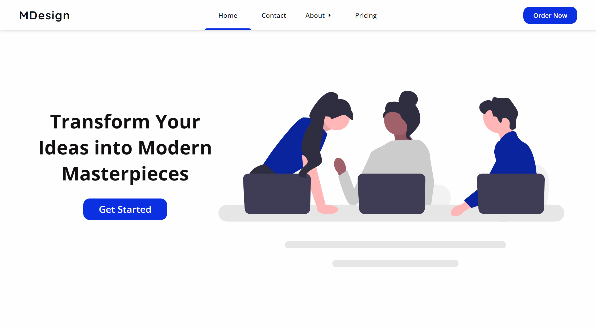
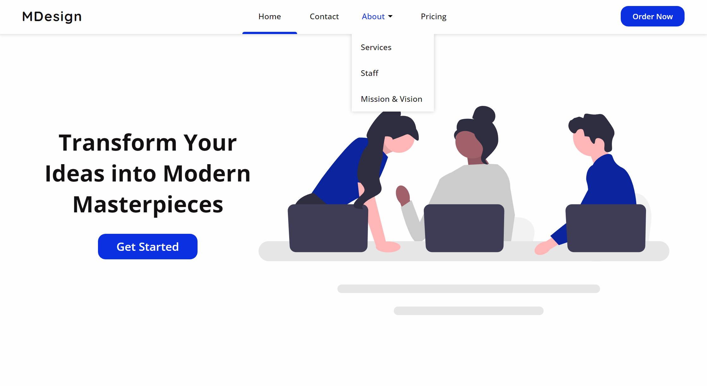

# modern-design-landing-page
A landing page for a mockup company: Modern Design, a brand, web, and graphic design company.




## Navbar with Vanilla HTML/CSS

```HTML
<div class="dropdown">
    <a href="#" class="link"><button class="nav__links__btn">About<div class="dropdown-icon"></div></button></a>
    <div class="dropdown__contents">
        <a href="#" class="link"><button class="nav__links__btn">Services</button></a>
        <a href="#" class="link"><button class="nav__links__btn">Staff</button></a>
        <a href="#" class="link"><button class="nav__links__btn">Mission &amp; Vision</button></a>
    </div>
</div>
```

```CSS
.dropdown {
  position: relative;
}

.dropdown__contents {
  display: none; /* changes to flex when you hover on dropdown div */
  position: absolute; /* set the parent dropdown menu div as position: relative; */
  background-color: var(--surface);
  flex-direction: column;
}

.dropdown:hover .dropdown__contents {
  display: flex;
}
```

```CSS
.dropdown-icon {
  width: 1.5rem;
  height: 1.5rem;
  background: url(../res/menu-right.svg) no-repeat;
  position: relative;
  top: 0.5px;
}

.dropdown:hover .dropdown-icon {
  background: url(../res/menu-down.svg) no-repeat;
  top: 0;
}
```

## My Favorite Miscellaneous Code Snippets

1. This Creates a Small Indicator For Navbar Links

```CSS
.selected::after {
  position: absolute;
  content: '';
  width: 12ch;
  height: 2px;
  border-bottom: 5px var(--primary) solid;
  border-radius: 24px 24px 0 0;
  bottom: 0;
}
```

2. This Clips Top `box-shadow`

```CSS
.dropdown__contents {
  box-shadow: 0 0 8px rgba(0, 0, 0, 0.2);
  clip-path: inset(0px -10px -10px -10px);
  /* clips anything starting from the top, but allows 10px on all other sides */
}
```

3. My Favorite Navbar Settings

```CSS
nav {
  height: 76px; /* 64px works too */
  background-color: var(--surface);
  display: flex;
  justify-content: space-between;
  align-items: center;
  padding: 0 3rem;
  box-shadow: 0 0 8px rgba(0, 0, 0, 0.2);
}
```